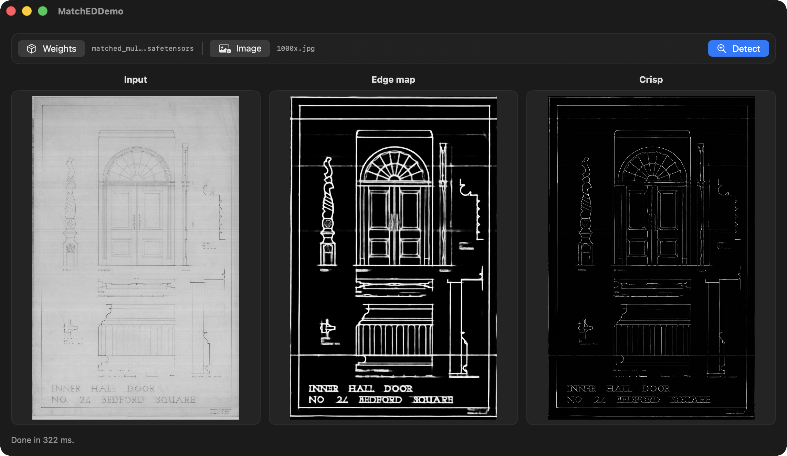

# mlx-swift-MatchEd

Apple-Silicon (MLX) port of **MatchEd** — *Crisp Edge Detection Using
End-to-End, Matching-based Supervision* (CVPR 2026). The edge-detection network
is [PiDiNet](https://github.com/hellozhuo/pidinet) (ICCV 2021) plus a small
`SmallUNet` "thinner" that produces the crisp output.



Ported from the PyTorch reference at
`../python/MatchED` (`models/pidinet.py`) with the
[`port-mlx-to-swift`](../../.claude/skills/port-mlx-to-swift) methodology.

## What runs

- **PiDiNet trunk** (`carv4`, `--sa --dil`, base width 60, `dil=24`) — every
  pixel-difference conv is folded into a vanilla convolution at weight-load
  time (the paper's own `--evaluate-converted` path), so the Swift model is
  plain grouped `Conv2d` throughout, no custom Metal.
- **CDCM / CSAM / MapReduce** side heads → 5 sigmoid edge maps.
- **SmallUNet thinner** with `track_running_stats=False` BatchNorm
  (`InstanceStatBatchNorm` — normalizes with the input's own statistics).

### Numerical parity

End-to-end vs the CPU PyTorch reference (`Scripts/matched_ref.py`), fp32:

| fixture | fused Δ | crisp (thin) Δ |
|---------|---------|----------------|
| random weights (`make_parity_fixture.py`) | 3.4e-06 | 2.2e-05 |
| **real BIPED weights + image** (`make_real_fixture.py`) | 5.3e-06 | 3.4e-04 |

Swift vs Python 8-bit edge PNGs differ by ≤ 1/255 per pixel (rounding only). The
thinner's Δ is a touch higher because its batch-statistics BatchNorm divides by
`√variance`, amplifying fp noise — still < 0.04 % of the [0,1] range.

The PDC→vanilla weight fold is separately proven **bit-identical to the original
authors' runtime op code** (`Scripts/verify_convert.py`: cd within float noise,
ad/rd exact).

## Usage

### 1. Convert a checkpoint

The pretrained MatchEd `.pth`
([Drive](https://drive.google.com/file/d/1JV5P2O8j8pTH6F70QjQRg7mw08sGvwC5/view))
is a *raw* PiDiNet checkpoint. Fold + transpose it once:

```bash
uv run Scripts/convert_weights.py checkpoint_013.pth weights/matched.safetensors
```

### 2. Detect edges

```bash
swift run -c release matched run \
  -w weights/matched.safetensors input.jpg -o out/
# → out/input_edge.png  (fused edge map)
# → out/input_thin.png  (crisp / thinned)
```

> Build/run with **xcodebuild** (or `swift run -c release`) — the Metal-capable
> toolchain MLX needs is only present there. For tests use xcodebuild:
> `xcodebuild -scheme mlx-swift-MatchEd-Package -destination 'platform=macOS' test`.

### Library API

```swift
import MatchEdKit

let matched = try MatchEd(weightsURL: url)
let out = try matched.detect(imageURL: imageURL)
try ImageIOHelper.saveGray(out.thin, url: outURL)   // crisp edges
// out.sideOutputs: [e1,e2,e3,e4, fused]; out.fused, out.thin — all [1,H,W,1]
```

## Parity & benchmark

```bash
# reproduce the golden fixture (random weights → full IO), then check Swift
uv run Scripts/make_parity_fixture.py
matched parity -w weights/matched_random.safetensors -f fixtures/parity.safetensors

# throughput + memory-leak watch (active memory stays flat ⇒ no leak;
# the multi-GB peak is MLX's reusable buffer cache, not a leak)
matched bench --height 320 --width 480 --iters 60
```

~20 fps at 320×480 on Apple Silicon (Release). Active memory oscillates in a
bounded band across iterations; for a long-lived host consider
`MLX.GPU.set(cacheLimit:)`.

## Documentation

`MatchEdKit` has DocC reference docs. Build the static site locally:

```bash
Scripts/build_docs.sh            # → docs/MatchEdKit/index.html
Scripts/build_docs.sh preview    # live-reload server
```

Once the repo is pushed and GitHub Pages is enabled, the site serves at
`https://mnmly.github.io/mlx-swift-MatchEd/`.

## SwiftUI demo

`Examples/MatchEdDemo` is a macOS app driving the **same** `MatchEdKit.MatchEd`
pipeline as the CLI (shared driver, swift-cli-gui-shared-driver). Pick a
`.safetensors` weights file and an image, press Detect — it shows the input,
fused edge map, and crisp (thin) output side by side. The model is loaded once
and reused across images.

```bash
open Examples/MatchEdDemo/MatchEdDemo.xcodeproj   # then Run (⌘R)
```

The app contains no model/conv/weight code — the MLX inference is confined to a
`ModelHost` **actor** (off the main actor, one detection at a time) and the view
model just `await`s it and publishes the resulting `CGImage`s.

## Layout

```
Sources/MatchEdKit/          PiDiNet, blocks, SmallUNet, ops, weight loading, MatchEd pipeline
Sources/matched/             CLI: run / parity / bench
Examples/MatchEdDemo/        SwiftUI app (same MatchEd driver)
Tests/                       end-to-end parity + shape tests
Scripts/                     matched_ref.py (oracle), convert_weights.py,
                             make_parity_fixture.py (random), make_real_fixture.py (real),
                             verify_convert.py (fold vs authors' op code)
```

Pretrained checkpoints (BIPED / NYUD / BSDS / Multicue) are the raw PiDiNet
`.pth` files from the paper's [Drive](https://drive.google.com/file/d/1JV5P2O8j8pTH6F70QjQRg7mw08sGvwC5/view);
`make_real_fixture.py CHECKPOINT.pth --tag <name>` both converts them to NHWC
safetensors and builds a matching parity fixture.
